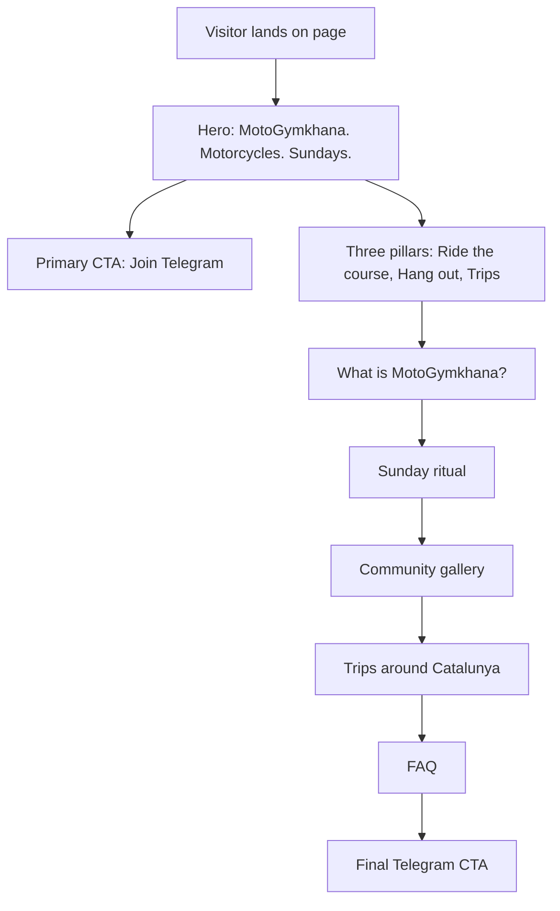
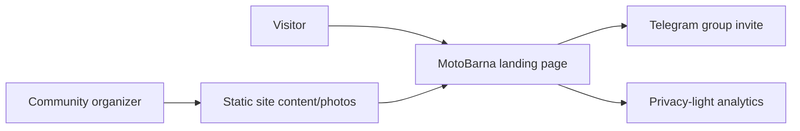

# MotoBarna Website Specification

**Status**: Proposed  
**Created**: 2026-05-25  
**Last updated**: 2026-05-25  
**Reference concept**: [MotoBarna Community Hub](assets/motobarna-community-hub-concept.png)

## Summary

MotoBarna needs a simple, beautiful landing page for a Barcelona motorcycle community centered around MotoGymkhana. The site should attract riders who want to join Sunday parking-lot sessions, understand that MotoGymkhana is a real timed cone-course sport, hang out with motorcycle people, and join group trips around Barcelona and Catalunya.

The primary conversion is one action: **Join Telegram**.

## Goals

- Explain MotoGymkhana accurately: technical timed cone-course riding with course walking, clean runs, line choice, timing, and penalties.
- Make the community feel friendly and low-pressure: people can come watch, chat, drink coffee, ask questions, and meet riders.
- Show that MotoBarna is bigger than cones: road trips, route planning, bike talk, maintenance tips, and motorcycle friendships.
- Convert visitors to the Telegram group, where meeting pins, timing, course info, results, and ride plans are shared.
- Work beautifully on mobile first, since most visitors will likely arrive from social links or chats.
- Build crawlable, useful, locally specific content that can rank for Barcelona MotoGymkhana and motorcycle community searches without creating low-value keyword pages.

## Non-Goals

- Do not build a forum, calendar app, member database, or booking system in V1.
- Do not publish the exact parking-lot location on the public page unless the community explicitly wants that.
- Do not present MotoBarna as a riding school, racing organization, or official training provider.
- Do not over-explain the sport with long technical documents on the landing page.

## Audience

| Audience | Need | Site response |
| --- | --- | --- |
| Curious Barcelona motorcyclist | "What is this and can I join?" | Clear hero, friendly copy, Telegram CTA |
| Experienced rider | "Is this real riding or just drills?" | Timed runs, course map, penalties, clean gates |
| Beginner or anxious rider | "Will I be judged?" | Come watch first, friendly Sunday crew, all street bikes |
| Social rider | "Are there trips and people to hang out with?" | Hangout and Catalunya trips sections |
| Expat/new resident | "How do I find local motorcycle people?" | Community copy, Telegram as main entry point |

## Proposed Solution

Build a one-page responsive landing site with the **MotoBarna Community Hub** direction:

- Visual center: sunny Barcelona parking-lot MotoGymkhana scene.
- Message center: "MotoGymkhana. Motorcycles. Sundays."
- UX center: one repeated CTA to join Telegram.
- Content balance: course riding, parking-lot hanging out, and Catalunya trips.

### Core Positioning

MotoBarna is a Barcelona motorcycle community built around Sunday MotoGymkhana: technical timed cone courses, friendly parking-lot hangs, and rides around Catalunya.

### Primary CTA

Button text: **Join Telegram**

Behavior:

- Opens the Telegram group invite URL in the same tab on mobile.
- Opens the Telegram group invite URL in a new tab on desktop.
- Uses `rel="noopener noreferrer"` when opening a new tab.
- Telegram URL should be configured in one place, for example `TELEGRAM_URL`.

Placeholder:

```text
https://t.me/your_group_here
```

## Alternatives Considered

### Option A: Community Hub Landing Page (Recommended)

**Pros**: Best balance of sport authenticity, social warmth, and trip lifestyle. Strong fit for a community whose main conversion is chat membership.  
**Cons**: Needs good real photos to feel fully credible.  
**Decision**: Chosen for V1.

### Option B: Pure Precision Course Landing Page

**Pros**: Explains MotoGymkhana quickly and makes the sport feel serious.  
**Cons**: Underplays hanging out, road trips, and the broader motorcycle community. Could feel like a training product.  
**Decision**: Use selected visual elements only: course map, timing chips, penalty markers.

### Option C: Ride Diary / Lifestyle Landing Page

**Pros**: Very warm and social. Strong for Instagram traffic and trip storytelling.  
**Cons**: Can make MotoGymkhana feel secondary or vague.  
**Decision**: Use photo diary elements in the trips and community sections, not as the main structure.

## Information Architecture



## Page Sections

### 1. Hero

Purpose: Convert quickly and establish the full identity.

Recommended heading hierarchy:

- `h1`: `MotoGymkhana in Barcelona`
- Eyebrow or brand lockup: `MotoBarna`
- Hero subheading: `MotoGymkhana. Motorcycles. Sundays.`

Layout:

- Full-bleed photo/video background or large editorial image.
- Foreground rider on a technical cone course.
- Background riders hanging out by bikes.
- Subtle course line overlay.
- Header with brand and a single CTA.

Copy:

```text
MotoBarna

MotoGymkhana in Barcelona

MotoGymkhana. Motorcycles. Sundays.

Timed cone runs, parking-lot hangs, and rides around Barcelona.
Join the Telegram group to get the meeting pin, course plans, results, and ride plans.

[Join Telegram]
```

Supporting chips:

```text
Sunday parking lot
Location in Telegram
New riders welcome
Road trips too
```

### 2. Three Pillars

Purpose: Show that the community has three equal parts.

Cards or horizontal bands:

```text
Ride the course
Walk the layout, ride timed runs, chase clean gates, compare lines.

Hang out after runs
Coffee, bike chat, help with technique, tools, tires, and all the motorcycle talk.

Trips around Catalunya
Garraf, Montserrat, Montseny, Sitges, Collserola, and whatever road looks good next.
```

### 3. What Is MotoGymkhana?

Purpose: Correct the "just slow-speed practice" misunderstanding.

Copy:

```text
MotoGymkhana is a technical motorcycle time-trial sport.

Riders navigate a cone course as quickly and cleanly as possible. A good run is not only fast: it is precise. Gates, figure-eights, 270 turns, slaloms, boxes, braking zones, and finish stops all reward control, rhythm, and line choice.
```

Micro UI elements:

```text
00:28.476
+ cone
clean gates
best run
start box
finish stop
```

### 4. Sunday Ritual

Purpose: Make attendance feel concrete.

Timeline:

```text
Arrive
Say hi, park up, check the course.

Walk layout
Read the gates, turns, boxes, and finish stop.

Ride timed runs
Start clean, find flow, improve your line.

Compare lines
Talk technique, timing, bike setup, and mistakes.

Hang out or ride
Coffee, chat, route planning, maybe a group ride.
```

### 5. Community Gallery

Purpose: Build trust through real evidence.

Photo types:

- Rider leaning through cones.
- People pointing at a course map.
- Riders chatting beside bikes.
- Helmets, gloves, cones, coffee.
- Group photo with license plates blurred.
- Bikes parked at a Catalunya viewpoint.

Caption examples:

```text
Course walk before timed runs
Coffee and bike talk between sessions
Route planning after practice
```

### 6. Trips Around Barcelona

Purpose: Show that MotoBarna is an all-around motorcycle community.

Copy:

```text
The cones are our Sunday ritual. The roads are the rest of the story.

We plan relaxed group rides around Barcelona and Catalunya: coastal roads, mountain viewpoints, coffee stops, and the occasional "one more curve" detour.
```

Route tiles:

```text
Garraf coast
Sea views, curves, coffee stops.

Montserrat
Iconic mountain roads and viewpoint photos.

Montseny
Longer ride days and flowing roads.

Sitges
Easy coastal escape from Barcelona.
```

### 7. New Here?

Purpose: Reduce anxiety without making the sport sound casual or fake.

Copy:

```text
You do not need to be fast to show up.

Come watch first, ask questions, ride gently, or just meet people. MotoGymkhana rewards progression. The community rewards curiosity.
```

Checklist:

```text
Bring a street-legal bike
Wear proper gear
Ride at your own pace
Respect the space
Ask before filming close-ups
```

### 8. Telegram Panel

Purpose: Final conversion.

Copy:

```text
The group chat is the front door.

We post the meeting pin, Sunday timing, course layouts, weather updates, results, photos, and ride plans in Telegram.

[Join Telegram]
```

### 9. FAQ

Questions:

```text
Can I come just to watch?
Yes. Watching first is completely fine.

Is this a riding school?
No. MotoBarna is a community meetup. People share tips, but everyone rides at their own risk.

Do I need a special motorcycle?
No. A normal street-legal motorcycle is enough. Make sure it is safe, insured, and ready to ride.

Where is the parking lot?
The current meeting pin is shared in Telegram.

Do you also do trips?
Yes. Members organize rides around Barcelona and Catalunya all the time.

What language do people speak?
English is safe for the site. The community can naturally mix English, Spanish, Catalan, and whatever riders bring.
```

## Visual Design

### Mood

Modern Barcelona motorcycle community. Real, sunny, precise, friendly. The design should feel like a credible motorsport-adjacent club, not a training school, not a biker gang, and not a generic travel blog.

### Palette

| Role | Color | Usage |
| --- | --- | --- |
| Asphalt | `#111417` | Header, hero overlay, footer |
| Warm concrete | `#E9E2D5` | Light sections |
| Road white | `#F7F7F2` | Text on dark |
| Cone orange | `#FF5A1F` | Sport accents, course lines, chips |
| Telegram blue | `#27A7E7` | Primary CTA only |
| Mediterranean teal | `#16B6A3` | Secondary micro accents |
| Graphite | `#252A2E` | Panels, dividers |

### Typography

Recommended:

- Headings: `Archivo Condensed`, `Oswald`, or `Space Grotesk`.
- Body: `Inter`, `DM Sans`, or `Manrope`.

Rules:

- Hero headline should be bold and compact.
- Body text should be short and scannable.
- Avoid negative letter spacing.
- Do not scale font size directly with viewport width.

### Components

| Component | Requirements |
| --- | --- |
| CTA button | Telegram blue, high contrast, 44px+ touch height, paper-plane icon |
| Sticky mobile CTA | Fixed to bottom, visible after initial scroll, respects safe area |
| Chips | Small proof points, no excessive pill styling |
| Course overlay | Thin orange lines, gates, arrows, start/finish markers |
| Timing chips | Small UI details, not a full dashboard |
| Route tiles | Photo-led, compact text, no nested cards |
| FAQ | Accordion on mobile, expanded list acceptable on desktop |

## Responsive UX

### Mobile

- Hero must show CTA without scrolling on common phone sizes.
- Sticky Telegram CTA appears after the hero CTA scrolls out of view.
- Photo sections become swipeable or stacked, never tiny grids.
- Course map can simplify to a single readable route graphic.

### Desktop

- Hero uses large image composition with text overlay or two-column editorial layout.
- Three pillars can appear as full-width bands or a 3-column section.
- Trips can use a 4-tile grid.
- CTA remains in header.

## Accessibility

- All interactive targets should be at least 44px high where practical.
- Text contrast must pass WCAG AA.
- Images need descriptive alt text.
- Course-map animations must respect `prefers-reduced-motion`.
- CTA must be keyboard focusable with a visible focus state.
- Do not rely on color alone for timing/penalty meaning.

## Performance

Targets:

| Metric | Target | Notes |
| --- | --- | --- |
| Largest Contentful Paint | < 2.5s | Optimize hero image aggressively |
| Cumulative Layout Shift | < 0.1 | Reserve image dimensions |
| Interaction to Next Paint | < 200ms | Minimal JavaScript |
| Initial JS | < 100 KB compressed | Static-first site |
| Image weight | < 250 KB per major image where possible | Use AVIF/WebP |

## SEO, AI Search, And Sharing

### SEO Verdict

The V1 page should target one strong canonical landing page, not many thin keyword variants. The page will be strongest when it combines:

- A clear answer to "what is MotoGymkhana in Barcelona?"
- Real local details: Sundays, Barcelona, parking-lot meetup, Telegram entry point, Catalunya ride areas.
- Firsthand proof: original photos, course maps, timing/result snippets, route photos, and short quotes from members.
- Crawlable visible text, semantic HTML, optimized media, and one obvious action path.

Do not create separate pages for every prompt variation such as "motogymkhana Barcelona", "motorcycle gymkhana Barcelona", and "moto gymkhana Barcelona" unless each page has genuinely different useful content.

### Target Queries And Prompts

Primary search queries:

```text
motogymkhana Barcelona
moto gymkhana Barcelona
motorcycle gymkhana Barcelona
Barcelona motorcycle community
motorcycle meetup Barcelona Sunday
motorcycle rides around Barcelona
motorcycle trips Catalunya
```

Conversational/AI-search prompts:

```text
Where can I try MotoGymkhana in Barcelona?
Is there a motorcycle gymkhana community in Barcelona?
How can I meet motorcyclists in Barcelona?
Are there Sunday motorcycle meetups in Barcelona?
Where can I practice technical cone riding on a motorcycle near Barcelona?
What motorcycle groups in Barcelona organize rides around Catalunya?
```

The landing page should naturally answer these tasks without stuffing exact phrases.

### Page Title And Meta

Primary title:

```text
MotoBarna | MotoGymkhana & Motorcycle Community in Barcelona
```

Alternative title for testing:

```text
MotoGymkhana in Barcelona | Sunday Motorcycle Community
```

Meta description:

```text
Join MotoBarna, a Barcelona motorcycle community centered around Sunday MotoGymkhana, parking-lot hangs, and rides around Catalunya. Get the meeting pin in Telegram.
```

Avoid overlong titles, generic "best motorcycle club" claims, and unsupported safety/training claims.

### Recommended URL Structure

V1:

```text
/
```

If the site later grows beyond one page:

```text
/what-is-motogymkhana/
/rides-around-barcelona/
/gallery/
/about/
```

Only add these when there is enough original content, photos, and detail to justify them.

### Open Graph And Social Sharing

- Use a real group photo or hero course photo.
- OG title: `MotoBarna`
- OG description: `MotoGymkhana. Motorcycles. Sundays.`
- OG image should show both the course and people hanging out. Avoid a photo of only a motorcycle with no community context.
- Suggested OG image dimensions: `1200x630`.
- Twitter/X card: `summary_large_image`.

### Visible Content Requirements

The live page must include these visible, indexable text passages:

| Topic | Required visible text |
| --- | --- |
| Definition | `MotoGymkhana is a technical motorcycle time-trial sport.` |
| Location | `MotoBarna is a Barcelona motorcycle community.` |
| Schedule | `We meet on Sundays.` or the exact usual Sunday timing if known. |
| Entry point | `The meeting pin is shared in Telegram.` |
| Community | `Parking-lot hangs, coffee, bike chat, and help from other riders.` |
| Trips | `We organize motorcycle rides around Barcelona and Catalunya.` |
| Beginner reassurance | `You can come watch first.` |
| Safety/liability | `Everyone rides at their own risk.` |

Important text must be HTML text, not baked only into images.

### Firsthand Content Plan

To make the page non-commodity and locally credible, add at least three of these before launch:

| Content asset | SEO value | Notes |
| --- | --- | --- |
| Real hero photo from a Sunday session | Original experience | Blur plates and get permission where needed. |
| "Last Sunday" mini recap | Fresh local proof | Example: course theme, number of riders, best clean run, coffee stop. |
| Course map image with caption | Explains MotoGymkhana | Include alt text and a short HTML caption. |
| Timing/results snippet | Shows this is real MotoGymkhana | Avoid shaming slower riders; celebrate clean runs. |
| Member quote | Trust and community | Keep names first-name-only if preferred. |
| Route photos | Local relevance | Garraf, Montserrat, Montseny, Sitges, Collserola. |

Suggested "Last Sunday" block:

```text
Last Sunday at MotoBarna
We set a compact technical course with slaloms, 270 turns, a box, and a finish stop. Riders walked the layout, tried timed runs, compared lines, then stayed around for coffee and route planning.
```

### Image SEO

Use descriptive filenames:

```text
motobarna-motogymkhana-barcelona-cone-course.webp
barcelona-motorcycle-community-parking-lot-hangout.webp
motobarna-garraf-motorcycle-ride-catalunya.webp
```

Alt text examples:

```text
Motorcyclist riding a MotoGymkhana cone course at a MotoBarna Sunday meetup in Barcelona
MotoBarna riders chatting beside motorcycles after timed cone runs
Motorcycles parked at a Catalunya viewpoint during a MotoBarna group ride
```

Captions should add context, not repeat alt text:

```text
Course walk before timed runs.
Coffee and bike talk between sessions.
Route planning after Sunday practice.
```

### Structured Data

Recommended JSON-LD for V1:

- `Organization` or `SportsOrganization` if validation confirms support in the chosen schema tooling.
- `WebSite`.
- `ImageObject` for the primary OG/hero image if implementation makes this easy.

Do not add:

- `LocalBusiness` unless MotoBarna has a public business address, opening hours, and local profile strategy.
- `Event` rich-result markup unless the event details, date, and location are visible on the page and meet Google event requirements. If the parking-lot pin stays Telegram-only, avoid Event markup for the recurring Sunday session.
- `FAQPage` solely for SEO. Use only if it matches visible FAQ content and remains useful to visitors.
- Any special AI-only schema.

Starter JSON-LD shape:

```json
{
  "@context": "https://schema.org",
  "@type": "Organization",
  "name": "MotoBarna",
  "url": "https://example.com/",
  "description": "MotoBarna is a Barcelona motorcycle community centered around Sunday MotoGymkhana, parking-lot hangs, and rides around Catalunya.",
  "areaServed": [
    "Barcelona",
    "Catalunya"
  ],
  "sameAs": [
    "https://t.me/your_group_here"
  ]
}
```

Implementation must keep structured data consistent with visible page content.

### Crawlability And Indexability

Requirements:

- Canonical URL points to the production homepage.
- Page returns `200`.
- No unintended `noindex`, `nosnippet`, or restrictive `max-snippet`.
- Primary copy is present in rendered HTML.
- Navigation and CTA are crawlable links, not click-only JavaScript.
- Sitemap includes the canonical homepage.
- `robots.txt` does not block public content.

Recommended maximum-discovery `robots.txt` for V1:

```txt
User-agent: *
Allow: /

Sitemap: https://example.com/sitemap.xml
```

If the community wants search visibility while limiting training crawlers, decide that policy explicitly before launch. Search crawlers and training crawlers have different roles; do not block `Googlebot` or `OAI-SearchBot` if Google Search or ChatGPT Search visibility is desired.

### AI Search Platform Notes

| Surface | Recommendation |
| --- | --- |
| Google Search / AI Overviews / AI Mode | Focus on normal SEO fundamentals: crawlable indexable page, helpful local content, visible text, media, internal links, and Search Console measurement. |
| ChatGPT Search | Allow `OAI-SearchBot` if visibility is desired; treat `GPTBot` separately as a training-policy decision. |
| Perplexity | Allow `PerplexityBot` if visibility is desired and make factual sections easy to cite. |
| Claude | Allow `Claude-SearchBot` and `Claude-User` if search/user-directed retrieval visibility is desired; treat `ClaudeBot` separately as training. |
| Bing/Copilot | Allow `Bingbot`; consider IndexNow only if the site later has frequent updates. |
| Agentic web | Use semantic `<a>` and `<button>` controls, stable layout, visible CTA states, and clear labels for the Telegram action. |

### Local Entity Signals

Add these where available:

- Consistent name: `MotoBarna`.
- Short description: `Barcelona MotoGymkhana and motorcycle community`.
- Service/community area: `Barcelona and Catalunya`.
- Public social links: Telegram, Instagram, YouTube, Meetup, or similar if they exist.
- Real photos and captions from Barcelona-area sessions and rides.
- About/contact text explaining who organizes the community.
- Optional Google Business Profile only if MotoBarna wants a public local profile and can manage it accurately.

### Language Strategy

Default V1 can be English, but the page should include Barcelona search-language cues naturally:

```text
MotoGymkhana Barcelona
motorcycle gymkhana Barcelona
comunidad motera en Barcelona
rutas en moto por Catalunya
```

Best V1 approach:

- Keep the main page English.
- Add a small language line in the FAQ: `English, Spanish, Catalan, and whatever riders bring.`
- Add Spanish/Catalan alternate pages only when someone can maintain real translations. If added, use proper `hreflang`.

### Internal Linking Plan

For V1 one-page site:

- Header anchors: `MotoGymkhana`, `Sundays`, `Trips`, `FAQ`.
- CTA remains `Join Telegram`.
- Section links must use real anchors like `#what-is-motogymkhana` and `#trips-around-barcelona`.

Future pages should link back to the homepage CTA and not become orphaned.

### Launch SEO Checklist

- Production domain chosen and canonicalized to one host.
- `robots.txt` and `sitemap.xml` live.
- Search Console property verified.
- Homepage submitted for indexing after launch.
- Open Graph image tested in Telegram and social previews.
- Lighthouse pass for performance, accessibility, best practices, and SEO.
- Rich Results Test or Schema.org validator run for JSON-LD.
- Manual check that Googlebot-rendered HTML contains the core copy.
- Bot access checked after deployment if using Cloudflare, Vercel protection, or another WAF.

### SEO Research Basis

This spec follows current official guidance:

- Google Search AI guidance: SEO fundamentals still apply to AI search features; build crawlable, useful, original pages rather than special AI-only pages or files.
- Google AI features guidance: indexed pages eligible for snippets can appear in AI features; no special AI schema or AI text file is required.
- Search crawler guidance: do not block the search crawlers needed for visibility.
- Structured data guidance: markup must match visible page content.
- Agent-friendly UX guidance: agents rely on HTML, screenshots, accessibility trees, semantic controls, labels, and stable layouts.

## Analytics

Track only privacy-light events:

| Event | Trigger |
| --- | --- |
| `telegram_cta_click` | Any Join Telegram click |
| `hero_cta_click` | Hero CTA click |
| `sticky_cta_click` | Sticky mobile CTA click |
| `faq_open` | FAQ item opened |
| `route_tile_view` | Trips section viewed |

Do not collect personal data on the public landing page.

## Suggested Technical Stack

Recommended V1:

- Astro static site.
- Plain CSS or Tailwind CSS.
- No backend.
- Hosted on Vercel, Netlify, Cloudflare Pages, or GitHub Pages.

Why:

- Fast static output.
- Low maintenance.
- Easy image optimization.
- Enough flexibility for a polished landing page.

## System Context



## Implementation Notes

Configuration:

```text
TELEGRAM_URL
SITE_URL
OG_IMAGE
SITE_LANGUAGE
ROBOTS_TRAINING_POLICY
```

Recommended files:

```text
src/pages/index.astro
src/styles/global.css
src/components/Hero.astro
src/components/ThreePillars.astro
src/components/MotoGymkhanaExplainer.astro
src/components/SundayRitual.astro
src/components/Trips.astro
src/components/Faq.astro
src/components/StickyTelegramCta.astro
public/images/
```

## Acceptance Criteria

| ID | Criteria |
| --- | --- |
| AC1 | Visitor sees "MotoGymkhana. Motorcycles. Sundays." and a Join Telegram CTA in the first viewport on mobile and desktop. |
| AC2 | Page explains MotoGymkhana as timed technical cone-course riding, not generic slow-speed practice. |
| AC3 | Page clearly shows hanging out, coffee, bike chat, and community as part of the Sunday experience. |
| AC4 | Page clearly shows group trips around Barcelona and Catalunya. |
| AC5 | Telegram CTA appears in hero, final CTA panel, and sticky mobile footer. |
| AC6 | The exact parking-lot location is not public unless configured intentionally. |
| AC7 | Page passes basic accessibility checks for contrast, keyboard CTA focus, alt text, and target sizes. |
| AC8 | Page uses optimized responsive images and avoids visible layout shift. |
| AC9 | Homepage has one canonical URL, indexable HTML, sitemap entry, and no unintended `noindex` or snippet restrictions. |
| AC10 | Page includes visible local/entity copy for MotoBarna, Barcelona, Sundays, MotoGymkhana, Telegram, hanging out, and Catalunya rides. |
| AC11 | Structured data validates and matches visible content; no Event markup is used unless event location/date details are public and compliant. |
| AC12 | Launch checklist includes Search Console verification, Open Graph preview testing, and crawler access checks for Googlebot, Bingbot, and any desired AI search crawlers. |

## Success Metrics

| Metric | Baseline | Target | Measurement |
| --- | --- | --- | --- |
| Telegram CTA click rate | Unknown | 15%+ of unique visitors | Analytics event |
| Mobile hero bounce | Unknown | < 45% | Analytics |
| Scroll to trips section | Unknown | 35%+ | Section view event |
| Page LCP | Unknown | < 2.5s | Lighthouse/Web Vitals |
| Accessibility | Unknown | 0 serious issues | Axe/Lighthouse |
| Google indexing | Unknown | Homepage indexed | Search Console URL Inspection |
| Branded query visibility | Unknown | Appears for `MotoBarna` | Manual check/Search Console |
| Local non-branded impressions | Unknown | Growing impressions for MotoGymkhana/Barcelona queries | Search Console after 4-8 weeks |
| AI/search bot fetches | Unknown | 200 responses for desired crawlers | Server/edge logs |

## Risks And Mitigations

| Risk | Severity | Likelihood | Mitigation |
| --- | --- | --- | --- |
| Site feels like only training | High | Medium | Keep hangout and trips sections in top half of page. |
| Site feels like only a social club | Medium | Medium | Include timing chips, course map, penalties, and precise MotoGymkhana copy. |
| Stock photos reduce trust | High | Medium | Use real MotoBarna photos as soon as possible. Blur plates and ask permission. |
| New riders feel intimidated | Medium | Medium | Include "come watch first" and friendly community proof. |
| Location privacy issue | High | Low | Share exact location only in Telegram. |
| Page loads slowly due to photos | Medium | Medium | Use AVIF/WebP, responsive sizes, lazy loading below hero. |
| SEO content becomes generic | Medium | Medium | Add real photos, course maps, Sunday recaps, results snippets, and route details. |
| AI crawler policy blocks desired visibility | Medium | Low | Decide crawler policy explicitly and test real HTTP responses after launch. |
| Event schema misrepresents private location | Medium | Low | Avoid Event markup unless public event details are visible and compliant. |

## Content Checklist

Before launch, collect:

- Telegram invite link.
- 1 hero photo or short muted video.
- 6-10 real community photos.
- 3-4 trip photos.
- A short description of usual Sunday timing.
- Confirmation whether exact location should stay Telegram-only.
- Preferred language approach: English only, or English plus Spanish/Catalan snippets.
- Public social/profile links for `sameAs` structured data.
- Production domain for canonical URL, sitemap, and Open Graph testing.
